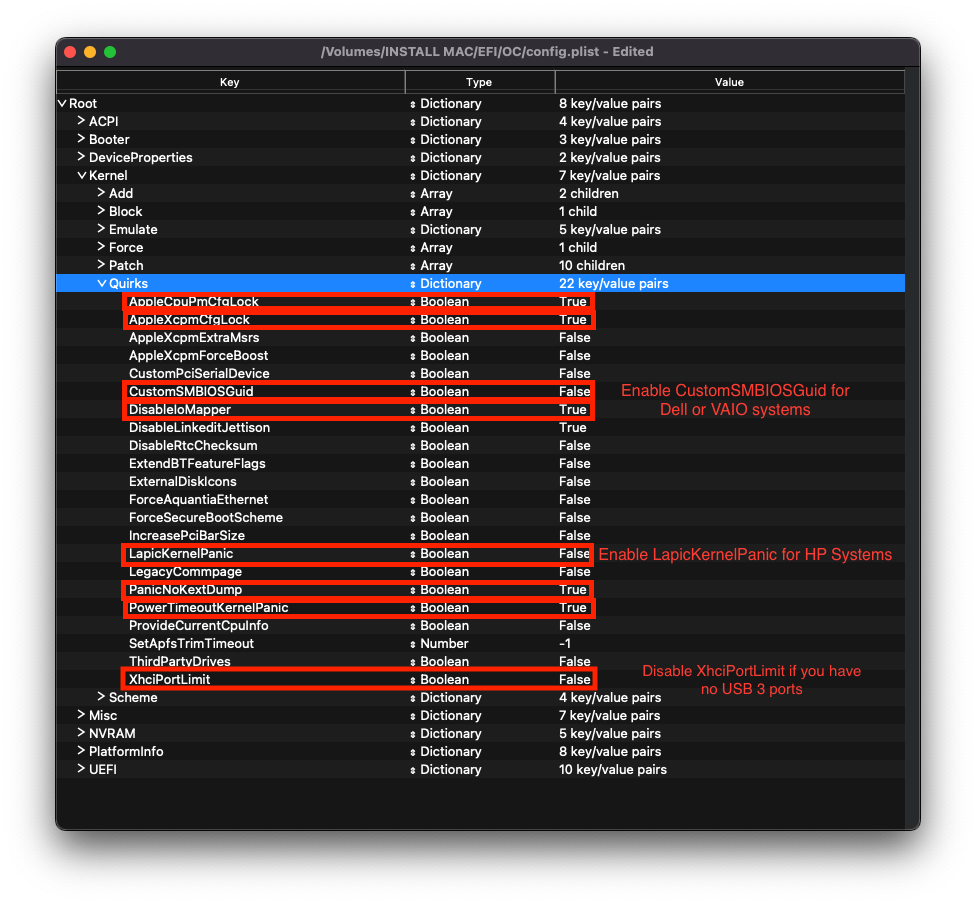

# Lynnfield and Clarkdale

<details>

<summary>Tổng quan</summary>

* OS X thấp nhất:&#x20;
  * OS X 10.6.3, Snow Leopard

<!---->

* Macos cao nhất:
  * macOS 12 Monterey
* Note: IGPU desktop Iron Lake không đuọc apple support
* Note2: Hầu hết Lynnfield và Clarkdale đều không hỗ trợ UEFI

</details>

## Chuẩn bị:&#x20;

B1: Tải propertree [tại đây](https://github.com/corpnewt/ProperTree)

B2: Tải GenSMBios [tại đây](https://github.com/corpnewt/GenSMBIOS)

B3: Tiến hành snapshot config theo hướng dẫn [tại đây](../build-efi/creat-efi.md#chinh-sua-config)

## Tiến hành&#x20;

### ACPI


Phần này không cần chỉnh sửa gì&#x20;


<figure><figcaption></figcaption></figure>

### Booter <a href="#booter" id="booter"></a>

| Legacy                                                    | UEFI                                                    |
| --------------------------------------------------------- | ------------------------------------------------------- |
| .png>) |  |

#### Quirks <a href="#quirks-2" id="quirks-2"></a>

**Legacy Settings**

| Quirk                  | Enabled | Comment                                 |
| ---------------------- | ------- | --------------------------------------- |
| AvoidRuntimeDefrag     | No      | Bigsur yêu cầu quirk này                |
| EnableSafeModeSlide    | No      |                                         |
| EnableWriteUnprotector | No      |                                         |
| ProvideCustomSlide     | No      |                                         |
| RebuildAppleMemoryMap  | Yes     | Qurik này yêu cầu từ OS X 10.4 đến 10.6 |
| SetupVirtualMap        | No      |                                         |

**UEFI Settings**

| Quirk                 | Enabled | Comment                                 |
| --------------------- | ------- | --------------------------------------- |
| RebuildAppleMemoryMap | Yes     | Qurik này yêu cầu từ OS X 10.4 đến 10.6 |

### DeviceProperties <a href="#deviceproperties" id="deviceproperties"></a>


IGPU dòng này không được support


<figure><figcaption></figcaption></figure>

### Kernel

<figure><figcaption></figcaption></figure>

#### ADD


Đây là phần để load kext bình thường không cần chỉnh


#### Emulate <a href="#emulate" id="emulate"></a>


Đây là mục fake CPU ID tham khảo chi tiết [tại đây](https://app.gitbook.com/s/WaDTVx2hJ0rjBEHrlRj9/general/fake-cpu-id)


#### Quirks <a href="#quirks-3" id="quirks-3"></a>

| Quirk                   | Enabled | Comment                                             |
| ----------------------- | ------- | --------------------------------------------------- |
| DisableIoMapper         | YES     | không cần nếu `VT-D` bị disable trong bios          |
| LapicKernelPanic        | NO      | HP sẽ cần Quirk này                                 |
| PanicNoKextDump         | YES     | không cần cho 10.12 và cũ hơn                       |
| PowerTimeoutKernelPanic | YES     | không cần cho 10.14 và cũ hơn                       |
| XhciPortLimit           | YES     |                                                     |
| AppleCpuPmCfgLock       | YES     | Không cần nếu `CFG-Lock` được `Disabled` trong bios |

#### Scheme <a href="#scheme" id="scheme"></a>


Liên quan đến các hệ thống Legacy


### Misc <a href="#misc" id="misc"></a>

<figure><figcaption></figcaption></figure>

#### Boot <a href="#boot" id="boot"></a>

| Quirk         | Enabled | Comment                                                                                                                   |
| ------------- | ------- | ------------------------------------------------------------------------------------------------------------------------- |
| HideAuxiliary | YES     | Ẩn các option phụ trong menu boot của opencore. Để hiện các option này các bạn có thể ấn space ở trong menu boot opencore |

#### Debug <a href="#debug" id="debug"></a>


Hữu ích với những người sử dụng opencore debug và để đọc lỗi khi boot gặp issue


| Quirk           | Enabled |
| --------------- | ------- |
| AppleDebug      | YES     |
| ApplePanic      | YES     |
| DisableWatchDog | YES     |
| Target          | 67      |

#### Security <a href="#security" id="security"></a>


Mục này cũng quan trọng đừng bỏ qua chúng ta sẽ có những thay đổi như sau


| Quirk                | Enabled  | Comment                                                                                                                                            |
| -------------------- | -------- | -------------------------------------------------------------------------------------------------------------------------------------------------- |
| AllowSetDefault      | YES      |                                                                                                                                                    |
| BlacklistAppleUpdate | YES      |                                                                                                                                                    |
| ScanPolicy           | 0        |                                                                                                                                                    |
| SecureBootModel      | Default  | Bình thường bạn hãy set nó là `Default` Để cho OpenCore tự set theo Smbios. Tuy nhiên đối với macos catalina- thì các bạn hãy set nó là `Disabled` |
| Vault                | Optional | Đây là một option quan trọng hãy đặt nó là `Optional` . Hãy nhớ rằng nó có phân biệt chữ hoa và chữ thường                                         |

### NVRAM <a href="#nvram" id="nvram"></a>

<figure><figcaption></figcaption></figure>

#### Add <a href="#add-4" id="add-4"></a>

* 4D1EDE05-38C7-4A6A-9CC6-4BCCA8B38C14
  * sử dụng cho OpenCore's UI scaling&#x20;
  * Mặc định thông thường là đủ
* 4D1FDA02-38C7-4A6A-9CC6-4BCCA8B30102
  * Chủ yếu để fix RTC
* 7C436110-AB2A-4BBB-A880-FE41995C9F82
  * Boot-arg chung

| boot-args       | Description                                                                                                                                         |
| --------------- | --------------------------------------------------------------------------------------------------------------------------------------------------- |
| **-v**          | Arg này sẽ enable verbose mode. Dùng để hiện thị lỗi khi boot OpenCore                                                                              |
| **debug=0x100** | Giúp ngăn khởi động lại khi bị panic. Cho phép bạn đọc được lỗi                                                                                     |
| **keepsyms=1**  | Dùng chung với debug=0x100 để giúp bạn có thể dễ dàng đọc các lỗi kernel panic                                                                      |
| **alcid=1**     | dùng để fix audio bằng apple alc xem chi tiết       [tại đây](https://app.gitbook.com/s/auskGAp5wYbI1xQWn4YZ/universal/patch-am-thanh-voi-applealc) |

* Arg GPU:

| boot-args            | Description                                                                                                                                                                                               |
| -------------------- | --------------------------------------------------------------------------------------------------------------------------------------------------------------------------------------------------------- |
| **agdpmod=pikera**   | Sử dụng để tắt board ID checks trên Navi GPUs (RX 5000 & 6000 series) nếu không sử dụng bạn sẽ nhận được 1 màn hình đen và chẳng có gì khác ngoài nó Không sử dụng nó nếu gpu của bạn không phải Navi GPU |
| **-radcodec**        | Cho phép các amd GPU không hỗ trợ chính thức sử dụng Hardware Video Encoder                                                                                                                               |
| **radpg=15**         | sử dụng để disable power-gating modes, Hữu ích cho GPU AMD                                                                                                                                                |
| **unfairgva=1**      | Sử dụng để fix hardware DRM support trên các AMD GPUs được hỗ trợ                                                                                                                                         |
| **nvda\_drv\_vrl=1** | Enable web driver cho Nvidia                                                                                                                                                                              |

* **csr-active-config**: `00000000`
  * Thiết lập sip mode mà không cần vào recovery
  * Tham khảo chi tiết [tại đây](https://app.gitbook.com/s/auskGAp5wYbI1xQWn4YZ/universal/sip-va-gatekeeper)
* **run-efi-updater**: `No`
  * Để ngăn các update firmware
* **prev-lang:kbd**: <>
  * để thiết lập ngô ngữ ban đầu khi cài đặt macos  `lang-COUNTRY:keyboard`
  * American: `en-US:0`(`656e2d55533a30`  là dạng HEX)
  * Full list keyboard: [AppleKeyboardLayouts.txt](https://github.com/acidanthera/OpenCorePkg/blob/master/Utilities/AppleKeyboardLayouts/AppleKeyboardLayouts.txt)
  * Hint: `prev-lang:kbd` có thể được chuyển thành string vì vậy bạn có thể điền vào `en-US:0` trực tiếp thay vì dùng hex
  * Hint 2: `prev-lang:kbd` có thể để trống (ví dụ `<>`) điều này sẽ làm xuất hiện bộ chọn ngôn ngữ khi cài đặt thay vì lần khởi động đầu tiên sau khi cài đặt

| Key           | Type   | Value   |
| ------------- | ------ | ------- |
| prev-lang:kbd | String | en-US:0 |

#### Delete <a href="#delete-3" id="delete-3"></a>

| Quirk      | Enabled |
| ---------- | ------- |
| WriteFlash | YES     |

### PlatformInfo <a href="#platforminfo" id="platforminfo"></a>

<figure><figcaption></figcaption></figure>

> Dùng SMBIOS gen để generate các smbios

| SMBIOS    | Hardware          |
| --------- | ----------------- |
| iMac11,1  | Lynnfield SMBIOS  |
| iMac11,2  | Clarkdale SMBIOS  |
| MacPro6,1 | Mojave và mới hơn |


Nếu bạn định chạy Mojave và mới hơn thì tôi khuyến khích bạn phải disable IGPU


Chạy gen smbios chọn 1 để download MacSerial và chọn 3 để select SMBIOS. kết quả sẽ ra tương tự như sau:

```
  #######################################################
 #               iMac10,1 SMBIOS Info                  #
#######################################################

Type:         iMac10,1
Serial:       C02KCYZLDNCW
Board Serial: C02309301QXF2FRJC
SmUUID:       A154B586-874B-4E57-A1FF-9D6E503E4580
```

#### Generic

| Gen SMBIOS   | Platform config    |
| ------------ | ------------------ |
| Type         | SystemProductName  |
| Serial       | SystemSerialNumber |
| Board Serial | MLB                |
| SmUUID       | SystemUUID         |

Bạn có thể ghi rom dump từ gen smbios vào config. Sau khi cài đặt bạn có thể sửa giá trị này theo hướng dẫn Fixing iServices [tại đây](https://app.gitbook.com/s/auskGAp5wYbI1xQWn4YZ/universal/fix-iservices)

> &#x20;Chú ý rằng bằng cần một serial không hợp lệ. Để kiểm tra điều này hãy nhập serial tại trang [Apple's Check Coverage Page](https://checkcoverage.apple.com/), bạn cần nhận được thông báo "Unable to check coverage for this serial number." khi nhập serial vào trang trên&#x20;

**Automatic**: YES

* tạo PlatformInfo dựa trên Generic thay vì DataHub, NVRAM, và SMBIOS

### UEFI

<figure><figcaption></figcaption></figure>

* **ConnectDrivers**: YES
  * Giúp bắt buộc load các driver. Nếu set thành `No` thì các driver sẽ tự động được thêm vào. Tuy nhiên không phải tất cả các driver đều chạy một số driver có thể không chạy dẫn dến lỗi

#### Drivers <a href="#drivers" id="drivers"></a>


không cần chỉnh sửa chỉ cần OC Snapshot


| Key       | Type    | Description                                                                                                                             |
| --------- | ------- | --------------------------------------------------------------------------------------------------------------------------------------- |
| Path      | String  | đường dẫn đến file trực tiếp trong folder `OC/Drivers`                                                                                  |
| LoadEarly | Boolean | cho phép driver load trước khi khởi tạo nvram chỉ nên bật cho `OpenRuntime.efi` và `OpenVariableRuntimeDxe.efi`nếu sử dụng legacy nvram |
| Arguments | String  | thêm một số arguments cho các driver                                                                                                    |

#### APFS <a href="#apfs" id="apfs"></a>


Mặc định OpenCore chỉ load các APFS drivers từ macOS Big Sur và mới hơn. Nếu bạn sử dụng Macos 10.15 và cũ hơn thì bạn sẽ cần chỉnh như sau



Nếu bạn đang dùng macOS Sierra hoặc cũ hơn có thể dùng HFS thay thế APFS. Bạn có thể bỏ qua phần này nếu đang dùng macos cũ hơn


| macOS Version           | Min Version        | Min Date   |
| ----------------------- | ------------------ | ---------- |
| High Sierra (`10.13.6`) | `748077008000000`  | `20180621` |
| Mojave (`10.14.6`)      | `945275007000000`  | `20190820` |
| Catalina (`10.15.4`)    | `1412101001000000` | `20200306` |
| No restriction          | `-1`               | `-1`       |

#### Input <a href="#input" id="input"></a>


Sử dụng keyboard cho hotkeys ở menu boot hoặc FileVault


| Quirk      | Value | Comment                              |
| ---------- | ----- | ------------------------------------ |
| KeySupport | NO    | Enable nếu bạn sử dụng hệ thống UEFI |

#### Output <a href="#output" id="output"></a>

| Output  | Value | Comment                                                                                                                                                                                               |
| ------- | ----- | ----------------------------------------------------------------------------------------------------------------------------------------------------------------------------------------------------- |
| UIScale | `0`   | <p><code>0</code>  sẽ tự set resolution<br><code>-1</code> sẽ để nó không thay đổi<br><code>1</code> cho 1x scaling, cho display bình thường<br><code>2</code> cho 2x scaling, cho HiDPI displays</p> |

#### Quirks <a href="#quirks-4" id="quirks-4"></a>


Liên quan đến các quirk về UEFI enviroment chúng ta sẽ thay đổi như sau


| Quirk                  | Enabled | Comment             |
| ---------------------- | ------- | ------------------- |
| IgnoreInvalidFlexRatio | YES     |                     |
| UnblockFsConnect       | NO      | Cần cho hệ thống HP |

#### ReservedMemory <a href="#reservedmemory" id="reservedmemory"></a>


Chủ yếu cho IGPU sandybirdge. Ở hướng dẫn này chúng ta sẽ tạm không đề cập đến nó

